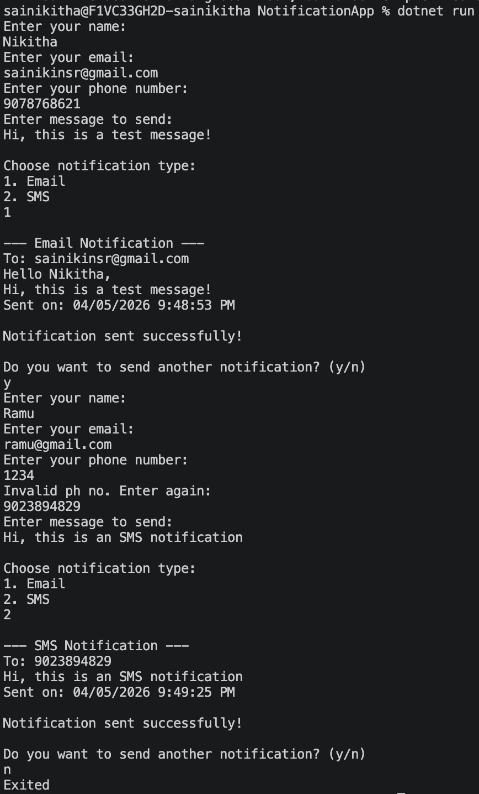

# Notification System (C#)

## Features
- Email Notification
- SMS Notification
- Input Validation
- Loop-based execution

## Concepts Used
- OOP (Encapsulation, Abstraction, Polymorphism)
- Interfaces
- Service-based design

## Run
dotnet run

## Folder-Structure 
- NotificationApp/
    │
    ├── Models/
    ├── Services/
    ├── Interfaces/
    ├── screenshots/
    │   ├── email_output.png
    │   ├── sms_output.png
    │   └── validation_output.png

## Output SS

